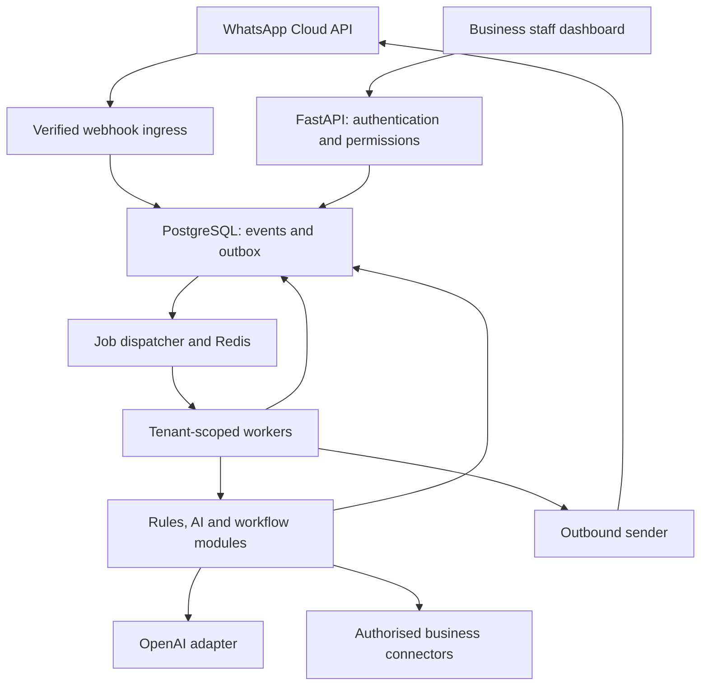

# WhatsApp Business Automation Platform — Project Blueprint

Version: 1.0 | Prepared: 2026-10-01 | Owner: HMKM Herath

Status: development specification; no software implementation is claimed by this document.

Read this file first, then `WEEK_01_IMPLEMENTATION_SPEC.md`. The founder will use a coding agent, review that agent's proposed implementation plan, implement one week at a time, and return with evidence before receiving the next week's detailed specification. The 12-week roadmap below is sequencing guidance, not permission to implement every week now.

## 1. Product objective and constraints

Build a subscription platform that lets independent businesses handle WhatsApp enquiries, staff handovers, orders, bookings and updates. Sell across suitable industries; do not require the founder to choose only one industry. Reuse business workflows and configure industry-specific data and rules.

- Developer: one founder with Python, Spring Boot and React experience, assisted by a coding agent.
- Target: an initial commercial release in approximately 12 weeks, subject to completed acceptance checks and external account approvals.
- Cash planning budget: LKR 80,000 across development and early trials. Founder labour, an existing computer and ordinary internet access are not included as purchases.
- AI provider: OpenAI only initially. No Gemini integration.
- Channel: official WhatsApp Business Platform / Cloud API. Live voice calls, unofficial WhatsApp automation and scraping are outside the initial release.
- Architecture: one maintained product, tenant-separated workspaces, modular feature packages, shared infrastructure initially. Dedicated deployments can use the same release later.
- End users: ordinary WhatsApp users can initiate messages without creating platform accounts. Business staff require dashboard accounts.
- Market: initially Sri Lanka; use LKR for platform billing and configurable business time zones.
- The founder is buying software development assistance, not asking this document to create or deploy the application.

## 2. Scope decisions and precedence

The earlier `WhatsApp_Chatbot_Packages_and_Billing_Plan.docx` is the commercial catalogue baseline. This blueprint adds implementation sequencing and technical decisions. It does not declare every catalogue promise available at launch.

Keep four independent concepts:

1. **Tenant:** a subscribing business workspace, with its staff, business data and configuration.
2. **Package:** a versioned combination of feature permissions and limits. Packages are not automatically cumulative tiers.
3. **Implementation availability:** whether a feature actually exists, has passed tests and is enabled for use.
4. **Release availability:** whether a package is supported and approved for sale, with all its advertised dependencies.

A configured entitlement cannot make an unimplemented module available. A tenant with a planned package can exist for demonstration, but the UI must identify missing capabilities. Do not sell the original package scope until the corresponding release gate passes. If scope changes, revise the customer offer explicitly.

Latest explicit founder instructions override planning defaults. Record material changes in an architecture decision record rather than silently changing this specification.

## 3. Initial technology decisions

| Area | Default | Reason / boundary |
|---|---|---|
| Frontend | React, TypeScript, Vite, React Router | Matches experience; dashboard application rather than a separate frontend per tenant |
| Backend | Python, FastAPI, Pydantic | One language for application and AI orchestration |
| Database | PostgreSQL, SQLAlchemy, Alembic | Relational workflows, migrations, transactional constraints, row-level security |
| Knowledge retrieval | pgvector plus approved text sources | Add in the knowledge phase, not Week 1 |
| Jobs | Celery and Redis | Workers for durable, retriable message and reminder processing; PostgreSQL remains the durable business record |
| File storage | Private object storage with tenant-scoped paths | Add with document ingestion; temporary local fixtures do not become production storage |
| Authentication | Server-side opaque sessions in HttpOnly cookies | Revocable staff sessions; no authentication tokens in browser localStorage |
| API hosting | Docker containers, same-origin web/API routing | Start simple; no Kubernetes or microservices fleet |
| AI | Configurable OpenAI adapter | Model IDs, token budgets, rates and timeouts configurable; evaluate languages before choosing the production model |
| WhatsApp | Shared provider app, customer-authorised business assets | Credentials remain server-side; each tenant maps to its authorised connection(s) |

Use supported stable versions available when implementation begins, pin resolved versions and commit lockfiles. Verify library APIs against their official documentation. Do not invent version numbers or copy deprecated examples. If Spring Boot is preferred later, review an explicit change proposal before replacing the backend.

## 4. Architecture

### 4.1 Deployment topology

The diagram is the target topology. Week 1 implements staff access, database separation and dashboard foundations only. A single codebase can have multiple API and worker instances. One platform does not mean one permanent chatbot process per customer or a guaranteed capacity for 100 businesses on one server.

### 4.2 Backend modules

| Module | Responsibility |
|---|---|
| `auth` | Staff identities, sessions, login controls and later invitations/recovery |
| `tenancy` | Memberships, validated tenant context, business settings and status |
| `plans` | Package versions, subscriptions, implementation availability and entitlements |
| `contacts` | Business-specific contact records and messaging identities |
| `whatsapp` | Connection registry, verified events, templates and provider status |
| `inbox` | Conversations, messages, assignment, bot/human ownership and notifications |
| `rules` | Welcome flows, approved fixed FAQs and routing rules |
| `knowledge` | Approved sources, ingestion, retrieval and source lifecycle |
| `ai` | Model adapter, bounded context, structured tool requests and response validation |
| `orders` | Catalogue, variants, basket validation, totals and fulfilment states |
| `bookings` | Services, availability, reservation validation and schedule connectors |
| `notifications` | Permission checks, status triggers, reminders, suppression and dispatch |
| `usage` | Reservations, settlements, allowances, provider cost records and alerts |
| `billing` | Platform invoices, manual payment recording and later payment adapters |
| `audit` | Staff changes, sensitive actions, operator activity and operational evidence |
| `integrations` | Typed connectors with defined fields, permissions and failure behaviour |

Separate module folders do not require separate services. Add real modules as their week begins; avoid unused framework scaffolding.

### 4.3 Trust boundaries and tenant isolation

- Staff tenant access comes from an authenticated user plus an active membership. A route's tenant UUID is a requested workspace, not proof of authorisation.
- WhatsApp tenant routing comes from a verified event and a server-maintained mapping of authorised business phone-number IDs. Never infer the tenant from message text.
- Background jobs carry a tenant identifier and identifiers of durable records. Workers revalidate the connection and relevant tenant state; tenant IDs do not grant arbitrary access.
- Tenant-owned database tables have non-null `tenant_id`, row-level security and policies for reads and writes. Use application checks as well.
- Database migrations use a separate owner role. Normal runtime is neither a superuser nor a table owner and has no `BYPASSRLS` or schema-creation privilege.
- Set tenant context transaction-locally on the same checked-out database connection used for queries. Missing context denies tenant data access. Do not retain context across pooled requests.
- Tables for global identities, sessions, memberships and plan administration are control-plane tables. Their access is through narrowly scoped services and permission-checked routes; they are not automatically protected by tenant-row policies.
- File paths, document retrieval, caches, queues, exports and audit access must also be tenant-scoped. A database policy alone is not full-system isolation.
- No shared conversation memory or shared vector retrieval across businesses. No AI-selected tenant IDs.
- Platform administrators manage account metadata. They do not receive implicit access to customer conversations or contact lists. Later support access must be explicit, time-limited and audited.

### 4.4 Inbound message lifecycle

1. Verify the webhook signature against the raw body; reject invalid events before routing.
2. Resolve the authorised business connection and tenant. Unknown connections fail closed without sending a reply.
3. Persist a normalised event with a unique provider event identity. Deduplicate redeliveries.
4. Acknowledge after durable persistence. Queue dispatch can be recovered from the outbox.
5. In tenant context, map the sender to a contact and the appropriate conversation. Sender identifiers and phone numbers are separate concepts; do not assume every future provider event exposes a telephone number.
6. Update the customer-service-window timestamp from the trusted inbound event.
7. Check tenant state, conversation ownership, package permissions and allowances.
8. Process a rule, AI answer or validated workflow action. Serialize conflicting actions for the same conversation where needed.
9. Persist the action and outbound intent. Retry dispatch safely; do not create a second order/booking because a task repeated.
10. Track submitted, accepted, delivered, read and failed states separately when available.

Outbound APIs are not necessarily exactly-once. If a send times out after the provider may have accepted it, do not blindly resend and claim perfect deduplication. Record an ambiguous state and use a bounded recovery policy. Idempotent business writes and application deduplication remain mandatory.

### 4.5 Human takeover

Conversation ownership states: `bot`, `human`, `paused`. Track assigned staff, change reason and an ownership version.

- Explicit requests for staff and unsupported actions create a handover reason.
- In `human` or `paused`, inbound messages remain visible but automatic answers stop.
- Recheck ownership immediately before sending a queued bot reply; discard stale replies after a takeover.
- A staff reply does not silently reactivate the bot. Resumption is an explicit authorised action.
- Show assigned staff, pending handovers and after-hours expectations.
- A provider's 24-hour window and template requirements still apply to staff messages sent through the API.

## 5. Complete commercial feature catalogue

Prices and allowances below are proposed terms from the existing catalogue, not verified tariffs or guaranteed profit. All amounts are LKR; platform subscriptions exclude Meta messaging and separately scoped provider charges.

| Code | Package | Monthly / setup | Staff | Monthly included limits | Release target |
|---|---|---|---:|---|---|
| `starter` | Business Starter | 6,900 / 20,000 | 1 | 1,000 rule replies; no AI | Initial release gate |
| `updates` | Customer Updates | 9,900 / 35,000 | 2 | 3,000 notification sends; no AI | Initial release gate |
| `receptionist` | AI Receptionist | 12,900 / 40,000 | 2 | 1,500 AI credits | Initial release gate |
| `order_desk` | WhatsApp Order Desk | 19,900 / 65,000 | 3 | 3,000 AI credits; 500 orders | Initial release gate |
| `appointments` | Appointment Assistant | 19,900 / 65,000 | 3 | 3,000 AI credits; 500 bookings | Initial release gate |
| `sales_leads` | Sales and Lead Assistant | 24,900 / 85,000 | 4 | 4,000 AI credits; 1,000 leads | After launch |
| `support_team` | Customer Support Team | 34,900 / 100,000 | 5 | 6,000 AI credits; 2,000 tickets | After launch |
| `connected_commerce` | Connected Commerce | 49,900 / 150,000 | 5 | 10,000 AI credits; 2,000 orders | After supported connector |
| `retention` | Customer Retention | 44,900 / 100,000 | 5 | 5,000 AI credits; 10,000 sends | After campaign controls |
| `enterprise` | Enterprise Operations | From 149,900 / from 600,000 | 20 | 30,000 AI credits; 10,000 workflow runs | Custom discovery |

### 5.1 Shared features in every saleable package

- One workspace and one connected number, except the scoped enterprise offer of up to three numbers.
- Named staff accounts within the agreed limit; owner, manager and agent permissions.
- Inbox, message history, customer record export and human takeover.
- Business profile, language settings, opening hours and escalation contacts.
- Usage counters and alerts with platform units distinct from Meta charges.
- Protected credentials, tenant isolation, backups, and agreed data retention/deletion.
- One initial training session and two configuration review rounds for standard small/medium onboarding.
- Visible pending/failed actions, external dependency failures and operational support boundaries.

Proposed routine monthly configuration assistance, by package in table order: 0.5, 1, 1, 1.5, 1.5, 2, 2.5, 3, 3 and 6 hours. Bug/incident maintenance is a separate operating responsibility, not automatically charged as new development. Standard human support hours are proposed as Monday–Friday 09:00–17:00 Sri Lanka time, excluding public holidays; agree final commitments in customer terms.

### 5.2 Business Starter

- Welcome message; buttons or numbered options; up to 20 approved fixed FAQ entries.
- Hours, location, delivery areas and approved service/product information.
- One configurable enquiry-capture flow: name, request and relevant contact details.
- Staff reply, pause/resume controls, enquiry reporting and contact export.
- Client-approved fixed translations. No model-generated answers or live stock/calendar integration.

### 5.3 Customer Updates

- Up to five approved templates for agreed order, service or reminder events.
- One supported source: a defined incoming webhook initially; spreadsheet adapters are later unless implemented and tested.
- Scheduled sends, status-change triggers, recipient/message permission records and opt-out suppression.
- Send log, provider delivery/failure statuses, bounded retries and duplicate-trigger handling.
- Replies route to staff; no included AI. Marketing classifications and fees must not be disguised as utility.
- Staff-triggered notices alone do not satisfy the original standard-source integration promise.

### 5.4 AI Receptionist

- Up to 50 approved FAQs and five text documents within 50 total text pages.
- English, Sinhala, Tamil and mixed-language evaluation; only advertise languages passing realistic acceptance tests.
- Grounded business answers, clarifying questions, enquiry capture and staff summaries.
- Complaints, unsupported questions and requests for staff trigger handover.
- Source approval, stale-source handling, bounded conversation context and usage accounting.
- No live stock, order creation, booking, payment verification, image extraction or voice included.

### 5.5 WhatsApp Order Desk

- Up to 100 catalogue products with defined variants, prices and staff-maintained availability.
- Product enquiries, quantities, recipient/address, delivery or collection, approved delivery fees.
- Backend-derived totals; customer-confirmed order summary; unique order reference.
- Initial states: `submitted`, `accepted`, `preparing`, `ready`, `dispatched`, `completed`, `rejected`, `cancelled`.
- Document permitted transitions and cancellation authority. A submitted request does not falsely claim staff acceptance or payment.
- Staff order dashboard, status changes and approved notifications; exception handover.
- Confirm product/price/availability changes before submission; safe duplicate handling.
- No live POS/courier/stock connection or automatic bank-slip verification in this package.

### 5.6 Appointment Assistant

- Up to 10 service types with durations, prices, buffers, working hours and cancellation rules.
- One implemented supported calendar adapter; availability lookup and final conflict check.
- Collect details, customer confirmation, booking reference, rescheduling/cancellation and reminders.
- Correct time zone conversion, overlapping requests, blackout periods and invalid/past times.
- Optional supported merchant payment link; payment status changes only from a trusted event.
- Build an internal authoritative schedule first. Original catalogue sale requires the advertised external calendar adapter to pass a release gate; otherwise offer a clearly revised internal-calendar scope.
- For external calendars, define conflict reconciliation and provider failure handling. A pre-insert availability check alone does not guarantee freedom from external double bookings.

### 5.7 Sales and Lead Assistant — later

- Agreed qualification questions: requirements, location, budget, timeline.
- Up to 20 approved offers and applicable matching rules; no invented discounts or eligibility promises.
- Lead records, summaries, explicit routing and one supported CRM with mapped fields.
- Authorised follow-ups and opt-out stopping; qualified-lead and recorded-outcome reports.

### 5.8 Customer Support Team — later

- Assigned inbox queues, tickets, up to three departments and ticket history.
- Up to 100 approved FAQs; one supported order/service lookup integration.
- Appropriate customer identity checks before private record lookup.
- Escalation, conversation summaries, feedback and response/resolution metrics.
- Refund/account-change authority checks; no promised employee replacement ratio or included 24-hour human team.

### 5.9 Connected Commerce — later

- One tested store connector; initial indexing up to 1,000 catalogue records.
- Live price/stock lookup, validated basket/order creation and supported checkout links.
- Verified payment/shipping events, return requests and exception routing.
- Reconciliation, stale data visibility and supported sales attribution.
- New ERP, gateway or courier integrations require their own scope.

### 5.10 Customer Retention — later

- Updates functions plus one contact source, permission evidence and unsubscribe suppression.
- Up to 10 segments and 10 approved templates; no purchased-list outreach.
- Audience preview, estimated message cost, staff approval and sending budget.
- Rate-limited campaign jobs, pause/cancel, delivery/read/reply reporting and grounded AI replies.
- Sales attribution only when reliable linked records support it; no guaranteed delivery or sales.

### 5.11 Enterprise Operations — custom

- Up to three numbers, 20 staff and three explicitly scoped integrations at the starting quote.
- Branch routing, branch-specific knowledge/prices, permissions, approvals and audit trails.
- Management reporting, priority incident queue and monthly service review.
- Additional discovery for dedicated hosting, SSO, regulated data, complex schedules, historical migration, 24-hour support or contractual uptime commitments.

## 6. Business data and industry configuration

Industry templates define optional form fields, approved vocabulary, example FAQs and workflow defaults. They do not create code forks.

- Restaurants: menu variants, collection/delivery, availability and staff fulfilment.
- Spare parts: exact catalogue identifiers, vehicle/model/year requirements and staff compatibility confirmation. Do not invent a fitment database.
- Service centres: service list, appointment requests, job references and staff-maintained service statuses. A full workshop/POS system is a separate product scope.
- Pharmacies: assess the specific permitted use case before enabling commerce. Do not use a generic retail configuration to facilitate restricted medicine sales or AI medical advice.
- Input sources start with structured dashboard entry and validated CSV imports. Later source adapters have explicit supported fields and read/write authority.
- Source authority: configured database/integration records for prices, stock, booking availability and action outcomes; approved sources for explanatory answers.

## 7. AI execution and quality

The model is a language interface, not the authority for money, access control or workflow success.

- OpenAI credentials never reach the browser or model prompt. Keep model/API parameters behind an adapter.
- Budget every request: bounded history, retrieval size, output tokens, timeout, tool-call count and total calls.
- Tool requests use allowlisted schemas. Server supplies tenant context and applies identity, role, package and business-state checks.
- Never execute model-generated SQL, shell commands or arbitrary outbound URLs.
- Treat incoming text and uploaded documents as untrusted content; they cannot override tenant or tool permissions.
- Replies must not say an order, appointment or payment succeeded before the backend confirms it.
- Where sources conflict or an exact part/product cannot be identified, ask for clarification or hand over.
- Test language quality with fluent reviewers and real English/Sinhala/Tamil/Singlish examples. No universal accuracy promise.
- Store bounded operational traces without retaining full prompts indiscriminately. Log enough to explain failures and provider consumption.
- Maintain an evaluation set covering grounding, hallucinated prices, wrong-tenant retrieval, tool misuse, complaints, missing information and limits.

## 8. Usage, billing and cost controls

### 8.1 Commercial arrangement

- Setup: proposed 50% before configuration and 50% after acceptance.
- Subscription: prepaid monthly from activation; Meta messaging paid by the customer through the supported billing route.
- Platform-owned OpenAI account by default; customer-specific usage and cost tracking.
- No automatic overage purchase without explicit authorisation and a cap.
- Manual invoices and bank-transfer confirmation are sufficient for early collection, but usage metering cannot be deferred.
- Additional development, connectors and source cleaning are separately scoped.

### 8.2 Units

- Standard AI credit: `max(1, ceil(max(total_input_tokens / 4000, total_output_tokens / 400)))` across calls producing one logical response on the approved economical text model. Use integer arithmetic; a response spanning multiple calls is not multiple unrelated free allowances.
- Premium models/audio/images: separate disclosed rates, disabled by default initially.
- Rule reply: one rule-generated outgoing message.
- Notification/campaign send: one recipient submission; internal duplicates/retries do not consume a second allowance. Record actual Meta billing separately.
- Order/booking/lead/ticket: one qualifying confirmed/new business record as defined in the customer terms. Failed attempts do not count as completed transactions.
- Workflow run: one agreed invocation; define it per enterprise scope.
- Proposed extra 1,000 standard AI credits: LKR 3,000, subject to quality/cost validation.

### 8.3 Enforcement

- Immutable usage events with tenant, period, metric, logical action ID, quantity and timestamps.
- Before work, atomically reserve the maximum authorised quantity/cost; settle actual use, release unused reservations and recover abandoned reservations.
- Parallel workers cannot overspend by reading and decrementing separate counters without locking/atomic updates.
- Failed internal processing can still incur provider cost. Record that cost even if the customer is not charged twice.
- Alert at 70%, 90%, 100%; pause the exhausted automation and expose a pending/handover state. Active subscriptions retain manual inbox access, subject to Meta rules and fees.
- Snapshot plan version, price and limits for each subscription. Package edits do not silently change existing contracts.
- Periods are half-open intervals `[start, end)` stored in UTC. Monthly anniversary uses a retained anchor day, clamped to the last valid day of shorter months. Restore the original anchor next month.
- Proposed five-day payment grace and suspension behaviour require customer terms; payment state differs from feature-usage exhaustion.
- Keep model price versions, currencies and exchange-rate assumptions separate from customer credit units. Do not hardcode the earlier illustrative FX rate as a current rate.

## 9. Release quality and operating requirements

Before accepting live customer data or payments, demonstrate:

- Tenant separation at API, database, retrieval, job, file and export layers.
- Staff login, owner/manager/agent restrictions, recovery/invitations and operator MFA or equivalently reviewed protection.
- Verified connection ownership, protected credentials and account revocation behaviour.
- Human takeover with stale queued replies suppressed.
- Duplicate webhook/task tests, safe business writes and visible ambiguous sends.
- Correct totals, booking concurrency, consent/opt-out checks and template-window behaviour.
- Usage reservation/settlement under concurrency and honest limit states.
- Backup restoration, migrations, rollback procedure, logs/alerts and staging/production separation.
- Onboarding checklist, client-approved data/languages, staff training, supported integrations and written service boundaries.

Capacity and uptime promises require measured load tests. No initial guarantee of 100 tenants or 24-hour incident response from a solo founder.

## 10. Roadmap — one week at a time

| Week | Focus | Evidence gate |
|---:|---|---|
| 1 | Repository, local stack, sessions, tenants, permissions, package catalogue, settings and contact isolation | Two businesses isolated at API and PostgreSQL levels; reproducible tests |
| 2 | Verified WhatsApp ingress, connection mapping, durable event/outbox skeleton, deduplication and worker boundaries | Recorded events route safely; invalid and duplicate events handled |
| 3 | Outbound sender, message/status history and inbox | Real/test connection exchange with correct send-state reporting |
| 4 | Human takeover, assignments, approved fixed FAQ/menu flows | Starter workflow passes; stale bot replies are suppressed |
| 5 | Knowledge ingestion, source approval, retrieval and document separation | Correct tenant retrieval with missing/conflicting source handling |
| 6 | AI adapter, language evaluation and usage reservation/settlement | Receptionist workflow passes quality, authority and spend checks |
| 7 | Notification templates, consent, opt-outs, reminders and standard incoming source webhook | Updates workflow passes window, retries and permission tests |
| 8 | Catalogue, variants, confirmed orders and staff status workflow | Order Desk passes totals, correction and duplicate-action tests |
| 9 | Internal booking engine, time zones and concurrency | Internal schedule correctly handles overlapping bookings |
| 10 | One external calendar adapter, reconciliation and subscription/invoice administration | Advertised calendar scope and billing behaviours demonstrated |
| 11 | Trials across suitable businesses, exports, invitations/recovery, operating controls and fixes | Business acceptance and recorded usage/support costs |
| 12 | Recovery/load/security checks, operator protection, deployment and launch review | Only completed packages marked saleable; release evidence archived |

A difficult integration or approval can move its package beyond Week 12 without delaying other completed packages. The next week's detailed scope is issued only after reviewing actual progress; coding agents do not use this roadmap to skip ahead.

## 11. Budget allocation and checkpoints

| Purpose | Three-month planning cap (LKR) |
|---|---:|
| Hosting/database/storage/backups | 15,000 |
| OpenAI development/trials | 15,000 |
| Domain/basic tools | 5,000 |
| WhatsApp tests/demonstrations | 10,000 |
| Visits/sales materials | 10,000 |
| Reserve | 25,000 |
| Total | 80,000 |

These are allocations, not live vendor quotes. Week 1 needs no paid AI, messaging or production hosting. Record actual commitments, taxes and currency conversion in a budget log. Account-registration costs, paid coding-agent subscriptions and larger provider fees, if needed, must fit the budget or trigger a revised allocation. Do not assume they are free or already covered. Do not use a free tier as an uptime promise.

## 12. Coding-agent operating contract

1. Read both specifications and inspect the target repository before making changes. If the repository already contains work, inventory it and propose adaptations rather than replacing it.
2. Produce `docs/plans/week-01-proposed-implementation.md` first, including files, migrations, security decisions, test coverage, risks and execution order.
3. The founder may bring that proposal back for review before implementing, as requested. No repository implementation has been approved by the creation of these planning files alone.
4. Work in small reviewed slices. Never invent completed features, tests, provider approvals or benchmark results.
5. Preserve the architecture and documented boundaries. Propose material changes rather than silently swapping frameworks, tenancy models or authentication.
6. Tests must verify business/security outcomes, not only mock implementation details. Use real PostgreSQL for isolation tests.
7. Do not put production keys, customer data or real passwords in prompts, repositories, screenshots or completion reports.
8. Use mocks for external calls in Week 1. Do not open a paid provider account, publish a deployment or spend money without the founder's instruction.
9. Keep a completion matrix: requirement ID, implementation location, verification command, result and unresolved limitation.
10. Stop at the current week's scope. Missing work remains visible; never replace a failed required test with a weaker test to make a report green.

## 13. References and interpretation

Checked on 2026-10-01. External documentation establishes provider/library behaviour; all product choices, prices, scheduling and limits here are planning decisions. Recheck current docs when implementing integrations.

- PostgreSQL row security: https://www.postgresql.org/docs/current/ddl-rowsecurity.html
- SQLAlchemy transaction management: https://docs.sqlalchemy.org/en/20/orm/session_transaction.html
- FastAPI background processing: https://fastapi.tiangolo.com/tutorial/background-tasks/
- Celery task processing: https://docs.celeryq.dev/en/stable/userguide/tasks.html
- OWASP session guidance: https://cheatsheetseries.owasp.org/cheatsheets/Session_Management_Cheat_Sheet.html
- OWASP CSRF guidance: https://cheatsheetseries.owasp.org/cheatsheets/Cross-Site_Request_Forgery_Prevention_Cheat_Sheet.html
- Meta official WhatsApp collections: https://www.postman.com/meta/whatsapp-business-platform/overview
- Meta WhatsApp messaging policy: https://business.whatsapp.com/policy
- Tech Provider implementation example (Twilio route, not a requirement to buy Twilio): https://www.twilio.com/docs/whatsapp/isv/tech-provider-program/integration-guide
- OpenAI model documentation: https://developers.openai.com/api/docs/models

## 14. Change log

- 1.0: Initial multi-industry platform blueprint and Week 1 handoff. Commercial catalogue kept separate from actual release availability. Python/React implementation chosen as the default. No application code generated.
